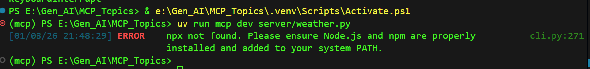

# MCP

## 1. Create Environment:
- Create a python environment with 3.11 version.  

```bash
uv init

.venv\Scripts\activate

uv pip install "mcp[cli]" httpx
```  

- Install required libreries.  

```bash
uv pip install -r requirements.txt
```  

## 2. Run / Host the MCP application with below cmd
```bash
uv run mcp dev server/weather.py
```  

## Error explaiination.

- If you get the below error while executing the MCP run command, it indicates that your laptop or server does not have Node.js installed. Ensure that you set up Node.js by following the steps below.    

- 

### NodeJS Instalation steps:

**Step 1️⃣ :** Go to 👉 https://nodejs.org

**Step 2️⃣ :** Download LTS version

**Step 3️⃣ :** Install with default options ✅

⚠️**Note:** Make sure these are checked during install:   
&nbsp;&nbsp;&nbsp;&nbsp; ✅ Add to PATH  
&nbsp;&nbsp;&nbsp;&nbsp; ✅ npm package manager
